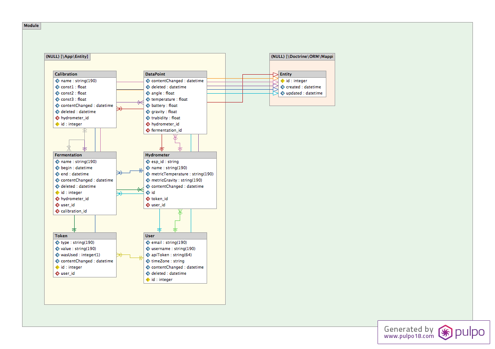

## ERM

A Hydrometer is identified by a token.
A Hydrometer can have a calibration and multiple datapoints with values and a date.
Datapoints can be grouped together to a fermentation, allowing the users to archive them.
Users are identified by email, have a username, an api-token and a timezone.
Token are used for registering, logging in and cookies.

An image outlining the ERM can be found in `docs/ERM.png`.

